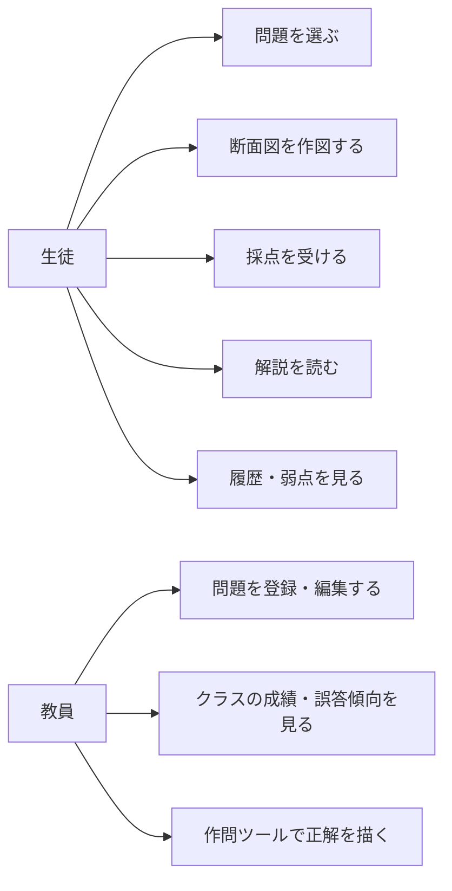
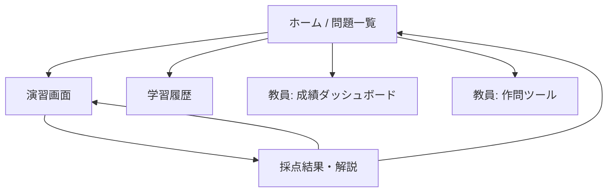

# 02. 要件定義

## 1. ユースケース



### ユーザーストーリー（抜粋）

- 生徒として、投影図の隣に方眼が用意された解答欄があり、**クリック／タップでセルを塗るだけ**で断面の形を描きたい。
- 生徒として、ハッチングは**自分で 45° の線を引くのではなく「ハッチングする／しない」を指定**したい（線の作画技能ではなくルールの理解を問うため）。
- 生徒として、間違えたときに**どのセルが違うのか**を色で見たい。
- 生徒として、「なぜ違うのか」を **JIS のルール名付き**で知りたい。
- 教員として、**コードを触らずに**スプレッドシートで問題を追加したい。
- 教員として、クラスで**どの誤りが多いか**を一覧で見たい。

## 2. 機能要件

優先度は MoSCoW（**M**ust / **S**hould / **C**ould / **W**on't）。「P」列は投入フェーズ（[05_ロードマップ](05_ロードマップ.md)）。

### 2.1 演習（生徒）

| ID | 機能 | 優先 | P |
|---|---|---|---|
| F-01 | 問題一覧から問題を選択する（分類・レベル・解答済みバッジ付き） | M | 2 |
| F-02 | 与えられた投影図（正面図・側面図・平面図＋切断線）を表示する | M | 1 |
| F-03 | 解答欄に方眼グリッドを表示する（中心線などのヒント線は初期表示） | M | 1 |
| F-04 | セルを塗る／消す（ドラッグで連続塗り、タッチ対応） | M | 1 |
| F-05 | 三角セル（左下・右下・右上・左上の 4 方向）で 45° 斜面を表現する | M | 1 |
| F-06 | 塗ったセルに対し「ハッチングする／しない」を指定する（既定：する） | M | 1 |
| F-07 | ハッチングは 45° の線として自動描画される | M | 1 |
| F-08 | 元に戻す／やり直し／全消去 | M | 1 |
| F-09 | 採点する（正誤・得点・誤り箇所のハイライト） | M | 1 |
| F-10 | 解説を表示する（正解図の重ね合わせ表示、ルール解説） | M | 1 |
| F-11 | ヒントを段階的に表示する（使うと減点） | S | 2 |
| F-12 | 解答途中の一時保存・再開 | S | 3 |
| F-13 | 学習履歴（解答済み問題、得点推移、弱点分類） | S | 3 |
| F-14 | 断面図の種類・用語を問う 4 択の知識問題 | C | 4 |
| F-15 | 制限時間モード／ランキング | C | 4 |
| F-16 | 解答用紙の印刷（PDF） | C | 4 |

### 2.2 出題データ管理（教員）

| ID | 機能 | 優先 | P |
|---|---|---|---|
| F-20 | 問題データをスプレッドシートで管理する（1 行 = 1 問、図形は JSON 列） | M | 2 |
| F-21 | 問題の有効／無効フラグ、公開順の並び替え | S | 2 |
| F-22 | 作問ツール：生徒と同じ UI で「与える投影図」と「正解」を描き、JSON を出力する | S | 3 |
| F-23 | 作問ツールから直接スプレッドシートへ保存する | C | 3 |

### 2.3 成績・分析（教員）

| ID | 機能 | 優先 | P |
|---|---|---|---|
| F-30 | 解答ログの記録（日時・ユーザー・問題 ID・得点・所要時間・解答 JSON） | M | 1 |
| F-31 | クラス別・問題別の正答率一覧 | S | 3 |
| F-32 | 誤答パターン別の集計（リブ切断／かくれ線残し／ハッチング漏れ 等） | S | 3 |
| F-33 | CSV エクスポート | C | 3 |

### 2.4 共通

| ID | 機能 | 優先 | P |
|---|---|---|---|
| F-40 | ログイン（Google アカウント）／匿名モード（出席番号入力） | M | 1 |
| F-41 | 管理者判定（教員メールアドレスのホワイトリスト） | M | 2 |
| F-42 | 設定（採点の厳しさ、ヒント可否）を PropertiesService で管理 | C | 3 |

## 3. 画面一覧と遷移



### 演習画面のレイアウト

```
┌───────────────────────────────────────────────────────────┐
│ 問題 3-(a)  全断面図 A-A            残り 05:00   [ホーム]  │
├──────────────────────────┬────────────────────────────────┤
│ 与えられた投影図          │ (答) A-A 断面図                 │
│  ┌────┐ ┌───┐            │   ┌───────────┐                │
│  │正面│ │側面│           │   │ 方眼グリッド │                │
│  │ 図 │ │ 図 │           │   │ ここに作図   │                │
│  └────┘ └───┘            │   └───────────┘                │
├───────────────────────────────────────────────────────────┤
│ [塗る][消す][◣][◢][◥][◤] │ [ハッチON][ハッチOFF] │ [↶][↷][🗑] │
│                                              [ヒント] [採点] │
└───────────────────────────────────────────────────────────┘
```

- **左**: 出題の投影図（SVG、切断線 A–A を強調表示）
- **右**: 解答グリッド。教科書と同じ方眼。中心線は最初から引かれている
- **下**: ツールバー。ペン種別（全塗り／三角 4 種／消しゴム）とハッチング指定を切り替える

## 4. 非機能要件

| 分類 | 要件 |
|---|---|
| **対応端末** | Chromebook / iPad / Windows PC。画面幅 1024px 以上で 2 カラム、768px 未満は 1 カラム縦積み |
| **入力** | マウス・タッチ・ペンに対応（Pointer Events で統一） |
| **性能** | 画面初期表示 3 秒以内、採点応答 1 秒以内（採点はクライアント側で即時実行し、記録は非同期で送信） |
| **同時利用** | 1 クラス 40 名の同時利用に耐える（記録書き込みは `LockService` で直列化、失敗時はリトライ） |
| **可用性** | Google のサービス可用性に準ずる。オフライン対応はしない |
| **アクセシビリティ** | キーボード操作（矢印キーでセル移動、Space で塗る）、色だけに依存しない誤り表示（記号を併用） |
| **セキュリティ** | 学校ドメイン内限定公開を既定とする。正解データはサーバ側でも保持し、最終得点はサーバで再計算する |
| **プライバシー** | 記録するのはメールアドレス／出席番号・問題 ID・得点・解答図形のみ。匿名モードではメールを保存しない |
| **保守性** | 問題追加にコード変更を伴わない。JSON スキーマにバージョン番号を持たせる |
| **国際化** | 日本語のみ（UI 文言は 1 ファイルに集約しておく） |

## 5. 学習内容の範囲（出題する内容）

JIS B 0001（機械製図）に準拠。

### 5.1 断面図の種類

| 種類 | 出題 | 備考 |
|---|---|---|
| 全断面図 | Phase 1 | 最初の基本。対象の基本中心線で切断 |
| 片側断面図（半断面図） | Phase 4 | 対称形状の 1/2 だけを断面にする |
| 部分断面図 | Phase 4 | 破断線で必要な部分だけ |
| 回転図示断面図 | Phase 4 | アーム・リブの断面を 90° 回転して図示 |
| **組合せによる断面図（階段断面）** | Phase 4 | 参考問題 (b) の `A-B-C-D` がこれ |
| 多数の断面図による図示 | 対象外 | |

### 5.2 ハッチングのルール

- 主な中心線または外形線に対して **45°** の等間隔の細い実線
- 同一部品の切り口は、離れていても**同じ角度・同じ間隔**
- 隣接する別部品は**角度を変える**か**間隔を変える**
- 切り口の面積が広いときは**輪郭に沿った部分だけ**に施してもよい
- ハッチング部分に文字・記号を書くときは**その部分を中断**する

### 5.3 長手方向に切断しない（＝ハッチングしない）もの ★最重要

> **リブ、アーム、歯車の歯、軸、キー、ピン、ボルト、ナット、小ねじ、座金、リベット、玉・ころ**

このルールの理解を問うことを、本アプリの中核的な学習目標とする。

### 5.4 その他のルール

- 断面図では、**かくれ線は原則として省略**する
- 切断線は一点鎖線、両端と屈曲部を太くし、矢印で見る方向を示す
- 切断面の向こう側に見える外形線は、断面図に**実線で描く**（切り口だけを描くのではない）
