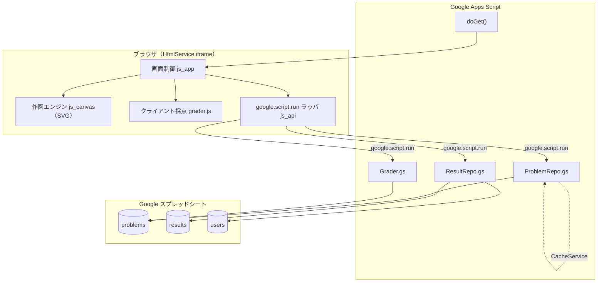

# 03. 設計方針

## 1. システム構成



### 採点を 2 か所に置く理由

| | 実行場所 | 役割 |
|---|---|---|
| **速報採点** | クライアント（`js_core.html`） | 「採点」ボタン押下から 1 秒以内に結果を出す。正解データは問題取得時に一緒に送られている |
| **確定採点** | サーバ（`Grader.gs`）※ Phase 3 | 記録として残す得点。クライアントの改ざんを受け付けない |

同じ採点ロジックを 2 実装持つと必ず乖離する。そこで採点は **`js_core.html` の
`SecCore` 1 か所だけ**に書き、GAS 非依存の素の JS に保つ。Phase 3 でサーバ採点を足すときは、
同じコードを `.gs` として読み込む（`eval` ではなくビルド時のコピー）。
`tools/test_core.js` は `js_core.html` から直接コードを取り出して検証するので、
テストは常に本番と同じコードを見ている。

Phase 1 は「クライアント採点のみ、記録は解答 JSON をそのまま送る」で開始する。

> 演習用途であり、成績評価に直結しないうちは速報採点のみで十分。定期考査で使う場合はサーバ確定採点を必須とする。

## 2. GAS ファイル構成

| ファイル | 責務 |
|---|---|
| `appsscript.json` | マニフェスト。`webapp.executeAs`, `webapp.access`, タイムゾーン、`oauthScopes` |
| `Code.gs` | `doGet(e)`、`include(filename)`、クライアントから呼ばれる API 関数の入口（薄く保つ） |
| `ProblemRepo.gs` | problems シートの読み込み、JSON パース、CacheService によるキャッシュ |
| `Grader.gs` | 採点ロジック（サーバ側）※ Phase 3 で追加 |
| `ResultRepo.gs` | results シートへの追記（`LockService`）、履歴・集計の取得 |
| `Auth.gs` | 利用者の識別（Google アカウント／匿名の両対応）。教員判定は Phase 2 で追加 |
| `index.html` | 画面骨格。`<?!= include('css') ?>` などで分割ファイルを結合 |
| `css.html` | スタイル |
| `js_core.html` | 線分の正規化と採点。GAS にもブラウザにも依存しない素の JS |
| `js_draw.html` | SVG 作図エンジン（描画・入力・当たり判定・重ね表示） |
| `js_app.html` | 画面の組み立て、状態管理、イベント配線、サーバ呼び出し |

問題データを作る道具（GAS には載せない）:

| ファイル | 責務 |
|---|---|
| `tools/solid.py` | 部品の形を直方体・角柱・円柱・穴で宣言し、正面図・側面図・断面図を導く |
| `tools/problem_lib.py` | セル集合から外形線を導く共通処理（`boundary` / `make_answer`） |
| `tools/make_problems.py` | 各問題の部品の形を定義し、問題データを生成 |
| `tools/test_core.js` | 採点ロジックの単体テストと問題データの検算 |

Phase 1 で実装済みのファイルは `Code.gs` / `Auth.gs` / `Problems.gs` / `ResultRepo.gs` /
`index.html` / `css.html` / `js_core.html` / `js_draw.html` / `js_app.html`。

### `doGet` の骨子

```javascript
function doGet(e) {
  const page = (e && e.parameter && e.parameter.page) || 'home';
  const t = HtmlService.createTemplateFromFile('index');
  t.page = page;
  t.isTeacher = Auth.isTeacher();
  return t.evaluate()
    .setTitle('製図・断面図トレーニング')
    .addMetaTag('viewport', 'width=device-width, initial-scale=1')
    .setXFrameOptionsMode(HtmlService.XFrameOptionsMode.ALLOWALL);
}

function include(filename) {
  return HtmlService.createHtmlOutputFromFile(filename).getContent();
}
```

## 3. サーバ API（`google.script.run` から呼ぶ関数）

| 関数 | 引数 | 戻り値 | 備考 |
|---|---|---|---|
| `apiGetIdentity()` | – | `{ok, identity:{mode, email}}` | `mode` は `google` か `anon` |
| `apiGetProblemList()` | – | `[{id, title, category, level, solved, bestScore}]` | 正解データは含めない |
| `apiGetProblem(problemId)` | `String` | `{ok, problem}`（[04](04_データモデルと採点.md) の JSON） | Phase 1 は正解も同送（クライアント採点のため） |
| `apiSubmit(problemId, answer, result, meta)` | `String, Object, Object, Object` | `{ok, logged}` | 解答ログの追記 |
| `apiGetHistory()` | – | `[{problemId, score, at}]` | 本人分のみ |
| `apiGetClassStats(filter)` | `Object` | 集計結果 | 教員のみ |
| `apiSaveProblem(problem)` | `Object` | `{ok, id}` | 教員のみ（作問ツール） |

### 呼び出し規約

- すべて **JSON 化可能な型のみ**をやり取りする（`Date` は ISO 文字列に変換して渡す）
- 例外は投げず、`{ok:false, error:'...'}` を返す（`withFailureHandler` は通信レベルの失敗にのみ使う）
- クライアント側は `js_api.html` の Promise ラッパ経由で呼ぶ

```javascript
function call(fn, ...args) {
  return new Promise((resolve, reject) => {
    google.script.run
      .withSuccessHandler(resolve)
      .withFailureHandler(reject)
      [fn](...args);
  });
}
```

## 4. データストア設計（Google スプレッドシート）

### `problems` シート（問題マスタ）

| 列 | 型 | 説明 |
|---|---|---|
| `id` | string | 問題 ID（例 `sec-a-001`）。一意 |
| `title` | string | 表示名（例「全断面図 A-A」） |
| `category` | string | `full` / `half` / `partial` / `revolved` / `offset` |
| `level` | number | 1〜5 |
| `enabled` | boolean | 出題対象か |
| `order` | number | 表示順 |
| `schemaVersion` | number | 問題 JSON のスキーマ版 |
| `data` | string(JSON) | 図形データ本体（[04](04_データモデルと採点.md)） |
| `explain` | string | 解説文（Markdown 可） |
| `updatedAt` | string | 更新日時 |

> `data` 列は 1 セル 50,000 文字の上限がある。方眼問題であれば数 KB に収まるため問題ないが、
> 上限に近づく場合は Drive 上の JSON ファイル参照に切り替える。

### `results` シート（解答ログ・追記のみ）

| 列 | 説明 |
|---|---|
| `at` | 解答日時（ISO 文字列） |
| `userKey` | メールアドレス、または匿名モードの `クラス-出席番号` |
| `userMode` | `google` / `anon`。どちらで識別したか |
| `problemId` | 問題 ID |
| `score` | 0–100 |
| `passed` | 合否 |
| `elapsedSec` | 所要時間 |
| `hintUsed` | 使ったヒント数 |
| `errorTags` | 誤答タグ（`rib-hatched,hidden-line-drawn` のようなカンマ区切り） |
| `answer` | 解答 JSON（再現・再採点用） |

- **追記のみ**（`appendRow`）。更新はしない → 競合が起きにくい
- 行数が 5 万行を超えたら、年度単位で別スプレッドシートへ退避する運用とする

### `users` シート（任意）

| 列 | 説明 |
|---|---|
| `userKey` | 識別子 |
| `displayName` | 表示名 |
| `class` | クラス |
| `role` | `student` / `teacher` |

教員判定は `users` シートまたは PropertiesService の `TEACHER_EMAILS` のいずれかで行う。

## 5. クライアント作図エンジン（`js_canvas`）

### なぜ SVG か

| | SVG | Canvas |
|---|---|---|
| 拡大・印刷時の品質 | ベクタなので劣化なし ◎ | ラスタ △ |
| 誤り箇所のハイライト | 要素を足すだけ ◎ | 全再描画 △ |
| 線種の表現 | `stroke-dasharray` で一点鎖線まで素直に書ける ◎ | 手書き △ |
| テーマ対応 | CSS 変数がそのまま効く ◎ | JS で色を持つ必要あり △ |
| 要素数 | 6×16 の方眼＋線 50 本程度なら問題なし | – |

→ **SVG を採用**。

### レイヤ構成（下から順に）

1. `layer-grid` … 方眼（薄いグレーの細線）
2. `layer-hint` … 出題側が与える中心線・基準線（一点鎖線）
3. `l-hatch` … ハッチング（1 マスにつき対角線 1 本。隣のマスと端点がつながり連続した 45° 線になる）
4. `l-answer` … 解説時に重ねる正解図（半透明）
5. `l-diff` … 採点後の誤り表示（不足＝青／余分＝赤の点線／線種違い＝橙）
6. `l-line` … 生徒が引いた線
7. `l-dots` … 格子点（線の端点になれる位置を示す）
8. `l-ghost` … ドラッグ中のプレビュー線とキーボードカーソル

### 入力処理

- `pointerdown` → `pointermove` → `pointerup`（`setPointerCapture`）
  - **線を引く**: 押した位置から最も近い格子点を始点にし、離した位置の格子点まで線を引く。
    ドラッグ中はプレビュー線を出す
  - **ハッチング**: 押したセルの現在状態を反転させ、その状態をドラッグ中のセルへ塗り広げる
    （ドラッグのたびに反転すると意図しない結果になるため）
  - **消しゴム**: ポインタから 0.3 マス以内の線分を消す。線が無ければセルのハッチングを消す
- `touch-action: none` を指定してスクロールと競合させない
- 操作の区切り（`pointerdown` 〜 `pointerup`）ごとにスナップショットを積む（Undo / Redo）
- キーボードでも作図できる（矢印キーで格子点を移動、Enter で始点→終点、Backspace で消去）

## 6. 権限・デプロイ

| 設定 | 値 | 理由 |
|---|---|---|
| 実行するユーザー | **自分（スクリプト所有者）**<br>`executeAs: USER_DEPLOYING` | 生徒に問題マスタ・成績シートの直接アクセス権を与えずに済む（**D-3**） |
| アクセスできるユーザー | **同じ組織内の全員**<br>`access: DOMAIN` | 学校ドメイン限定 |
| 必要スコープ | `spreadsheets`, `userinfo.email` | `appsscript.json` に明示 |

### 利用者の識別（D-2: 両対応）

「実行するユーザー = 所有者」でも、**閲覧者が所有者と同じ Google Workspace ドメインにいれば**
`Session.getActiveUser().getEmail()` は閲覧者のメールアドレスを返す。
個人アカウントや一般公開では空文字が返る。この性質をそのまま両対応の分岐に使う。

```
Auth.identity()
  ├ IDENTITY_MODE = anon        → 匿名モード（メールを一切参照しない）
  └ それ以外
      ├ メールが取れた           → { mode:'google', email:'…' }
      └ 空だった                 → { mode:'anon' }（クラス・出席番号を画面で申告）
```

スクリプトプロパティ `IDENTITY_MODE`（`auto` 既定 / `google` / `anon`）で明示的に切り替えられる。
匿名モードでは、入力されたクラスと出席番号を `localStorage` に覚えて次回以降の入力を省く。
HtmlService の iframe はオリジンが変わることがあり読み出せない場合もあるが、
そのときは入力し直してもらうだけで動作に影響はない。

**採点は名前の入力を待たない。** 未入力のまま採点した場合は結果を先に表示し、
記録だけを保留して、入力された時点で送信する（`sendLog` / `flushPending`）。

## 7. GAS 固有の制約と対策

| 制約 | 影響 | 対策 |
|---|---|---|
| `HtmlService` は iframe サンドボックス | 外部 CDN の JS/CSS 読み込みに制約、`window.top` へアクセス不可 | 依存ライブラリを使わず素の JS で書く。SVG はブラウザ標準機能のみ |
| `google.script.run` は非同期のみ、戻り値は JSON 化可能な型 | 同期的な処理が書けない、`Date` がそのまま返らない | Promise ラッパを用意。日時は ISO 文字列で統一 |
| 1 実行あたり 6 分 | 大量集計がタイムアウト | 集計は日次トリガーで別シートに事前計算。ダッシュボードはその結果を読むだけにする |
| スプレッドシート API の呼び出しが遅い | 問題一覧の表示が遅い | `getDataRange().getValues()` で一括読み込み、`CacheService`（6 時間）にキャッシュ。更新時にキャッシュを破棄 |
| `CacheService` は 1 キー 100KB 上限 | 問題データが入り切らない | 問題ごとにキー分割。一覧（軽量）と本体（重量）を分ける |
| 同時書き込みで行が壊れる | 記録欠損 | `LockService.getScriptLock()` で 30 秒待機、`appendRow` のみ使用 |
| 日次実行時間クォータ | 大規模利用で停止 | 1 校規模では余裕。集計トリガーは 1 日 1 回に限定 |
| バージョン管理が弱い | 変更のロールバックが困難 | **clasp + Git** でソースを管理し、デプロイはバージョン付きで行う |

## 8. 開発・デプロイ手順（予定）

```bash
npm install -g @google/clasp
clasp login
clasp create --type webapp --rootDir ./src   # 初回のみ
clasp push                                    # src/ を GAS へ反映
clasp deploy -d "v0.1.0 MVP"                  # バージョン付きデプロイ
```

- `.clasp.json`（スクリプト ID を含む）は **Git 管理しない**。`.clasp.json.example` を置く
- スプレッドシート ID は PropertiesService に置き、コードに直書きしない
