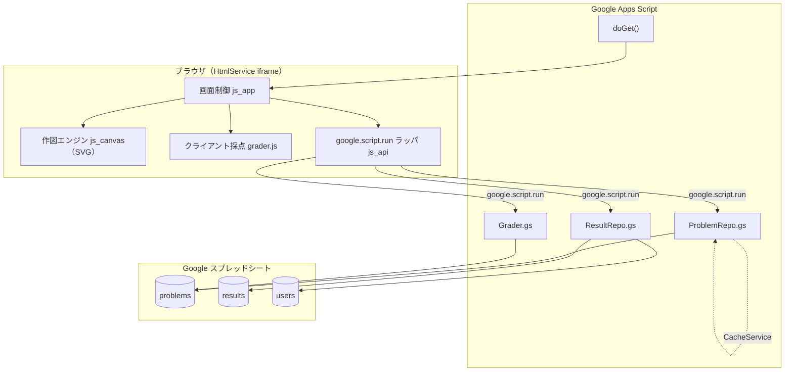

# 03. 設計方針

## 1. システム構成



### 採点を 2 か所に置く理由

| | 実行場所 | 役割 |
|---|---|---|
| **速報採点** | クライアント（JS） | 「採点」ボタン押下から 1 秒以内に結果を出す。正解データは問題取得時に一緒に送られている |
| **確定採点** | サーバ（`Grader.gs`） | 記録として残す得点。クライアントの改ざんを受け付けない |

同じ採点ロジックを 2 実装持つと乖離するため、**採点関数は 1 ファイル（`Grader`）に書き、
GAS 側は `.gs` として、クライアント側は同じ内容を `js_grader.html` として持つ**方針とする。
Phase 1 は「クライアント採点のみ、記録は解答 JSON をそのまま送る」で開始し、
Phase 3 でサーバ再計算を追加する（乖離リスクを後ろ倒しにする）。

> 演習用途であり、成績評価に直結しないうちは速報採点のみで十分。定期考査で使う場合はサーバ確定採点を必須とする。

## 2. GAS ファイル構成

| ファイル | 責務 |
|---|---|
| `appsscript.json` | マニフェスト。`webapp.executeAs`, `webapp.access`, タイムゾーン、`oauthScopes` |
| `Code.gs` | `doGet(e)`、`include(filename)`、クライアントから呼ばれる API 関数の入口（薄く保つ） |
| `ProblemRepo.gs` | problems シートの読み込み、JSON パース、CacheService によるキャッシュ |
| `Grader.gs` | 採点ロジック（サーバ側） |
| `ResultRepo.gs` | results シートへの追記（`LockService`）、履歴・集計の取得 |
| `Auth.gs` | 実行ユーザー取得、教員判定（管理者メール一覧は PropertiesService） |
| `index.html` | 画面骨格。`<?!= include('css') ?>` などで分割ファイルを結合 |
| `css.html` | スタイル |
| `js_api.html` | `google.script.run` を Promise 化するラッパ |
| `js_canvas.html` | グリッド作図エンジン（SVG の生成、ヒットテスト、描画） |
| `js_grader.html` | 採点ロジック（`Grader.gs` と同じアルゴリズム） |
| `js_app.html` | 画面遷移・状態管理・イベント配線 |

### `doGet` の骨子

```javascript
function doGet(e) {
  const page = (e && e.parameter && e.parameter.page) || 'home';
  const t = HtmlService.createTemplateFromFile('index');
  t.page = page;
  t.isTeacher = Auth.isTeacher();
  return t.evaluate()
    .setTitle('製図・断面図トレーニング')
    .addMetaTag('viewport', 'width=device-width, initial-scale=1')
    .setXFrameOptionsMode(HtmlService.XFrameOptionsMode.ALLOWALL);
}

function include(filename) {
  return HtmlService.createHtmlOutputFromFile(filename).getContent();
}
```

## 3. サーバ API（`google.script.run` から呼ぶ関数）

| 関数 | 引数 | 戻り値 | 備考 |
|---|---|---|---|
| `apiGetProblemList()` | – | `[{id, title, category, level, solved, bestScore}]` | 正解データは含めない |
| `apiGetProblem(problemId)` | `String` | `Problem`（[04](04_データモデルと採点.md) の JSON） | Phase 1 は正解も同送（クライアント採点のため） |
| `apiSubmit(problemId, answer, meta)` | `String, Object, Object` | `{score, detail, feedback[]}` | 記録の追記も行う |
| `apiGetHistory()` | – | `[{problemId, score, at}]` | 本人分のみ |
| `apiGetClassStats(filter)` | `Object` | 集計結果 | 教員のみ |
| `apiSaveProblem(problem)` | `Object` | `{ok, id}` | 教員のみ（作問ツール） |

### 呼び出し規約

- すべて **JSON 化可能な型のみ**をやり取りする（`Date` は ISO 文字列に変換して渡す）
- 例外は投げず、`{ok:false, error:'...'}` を返す（`withFailureHandler` は通信レベルの失敗にのみ使う）
- クライアント側は `js_api.html` の Promise ラッパ経由で呼ぶ

```javascript
function call(fn, ...args) {
  return new Promise((resolve, reject) => {
    google.script.run
      .withSuccessHandler(resolve)
      .withFailureHandler(reject)
      [fn](...args);
  });
}
```

## 4. データストア設計（Google スプレッドシート）

### `problems` シート（問題マスタ）

| 列 | 型 | 説明 |
|---|---|---|
| `id` | string | 問題 ID（例 `sec-a-001`）。一意 |
| `title` | string | 表示名（例「全断面図 A-A」） |
| `category` | string | `full` / `half` / `partial` / `revolved` / `offset` |
| `level` | number | 1〜5 |
| `enabled` | boolean | 出題対象か |
| `order` | number | 表示順 |
| `schemaVersion` | number | 問題 JSON のスキーマ版 |
| `data` | string(JSON) | 図形データ本体（[04](04_データモデルと採点.md)） |
| `explain` | string | 解説文（Markdown 可） |
| `updatedAt` | string | 更新日時 |

> `data` 列は 1 セル 50,000 文字の上限がある。方眼問題であれば数 KB に収まるため問題ないが、
> 上限に近づく場合は Drive 上の JSON ファイル参照に切り替える。

### `results` シート（解答ログ・追記のみ）

| 列 | 説明 |
|---|---|
| `at` | 解答日時（ISO 文字列） |
| `userKey` | メールアドレス、または匿名モードの `クラス-出席番号` |
| `problemId` | 問題 ID |
| `score` | 0–100 |
| `passed` | 合否 |
| `elapsedSec` | 所要時間 |
| `hintUsed` | 使ったヒント数 |
| `errorTags` | 誤答タグ（`rib-hatched,hidden-line-drawn` のようなカンマ区切り） |
| `answer` | 解答 JSON（再現・再採点用） |

- **追記のみ**（`appendRow`）。更新はしない → 競合が起きにくい
- 行数が 5 万行を超えたら、年度単位で別スプレッドシートへ退避する運用とする

### `users` シート（任意）

| 列 | 説明 |
|---|---|
| `userKey` | 識別子 |
| `displayName` | 表示名 |
| `class` | クラス |
| `role` | `student` / `teacher` |

教員判定は `users` シートまたは PropertiesService の `TEACHER_EMAILS` のいずれかで行う。

## 5. クライアント作図エンジン（`js_canvas`）

### なぜ SVG か

| | SVG | Canvas |
|---|---|---|
| セルごとのイベント | 要素に直接付けられる ◎ | 座標計算が必要 △ |
| 拡大・印刷時の品質 | ベクタなので劣化なし ◎ | ラスタ △ |
| 誤り箇所のハイライト | クラス付け替えだけ ◎ | 全再描画 △ |
| 要素数 | 12×16 = 192 セル程度なら問題なし | – |

→ **SVG を採用**。

### レイヤ構成（下から順に）

1. `layer-grid` … 方眼（薄いグレーの細線）
2. `layer-hint` … 出題側が与える中心線・基準線（一点鎖線）
3. `layer-solid` … 生徒が塗ったセル（塗りつぶし）
4. `layer-hatch` … ハッチング（45° 線。`<pattern>` で塗る）
5. `layer-outline` … 塗り領域の外周に自動生成する外形線（太い実線）
6. `layer-feedback` … 採点後の誤り表示（不足＝青／余分＝赤／ハッチング違い＝橙）
7. `layer-answer` … 解説時に重ねる正解図（半透明）

### 入力処理

- `pointerdown` → `pointermove` → `pointerup` で連続塗り（`setPointerCapture`）
- 現在の「ペン」（全塗り／三角 4 種／消しゴム）と「ハッチング指定」の組み合わせでセル状態を決める
- 状態変更のたびにコマンドをスタックへ積む（Undo / Redo）
- `touch-action: none` を指定してスクロールと競合させない

### 外形線の自動生成

塗られたセルの集合から、**隣接セルが空であるエッジ**を抽出して外形線とする。
三角セルは斜辺を外形線として追加する。これにより、生徒は「線を引く」操作をせずに済み、
採点も「セル集合の一致」という単純な比較に還元できる。

## 6. 権限・デプロイ

| 設定 | 値 | 理由 |
|---|---|---|
| 実行するユーザー | **アクセスしているユーザー** | `Session.getActiveUser().getEmail()` で本人を特定するため |
| アクセスできるユーザー | **同じ組織内の全員** | 学校ドメイン限定 |
| 必要スコープ | `spreadsheets`, `script.external_request`（不要なら削除）, `userinfo.email` | `appsscript.json` に明示 |

> 「実行するユーザー = アクセスしているユーザー」にすると、生徒自身の権限でスプレッドシートを書く必要が生じる。
> **問題マスタと成績シートを生徒に直接公開したくない**ため、実運用では
> 「実行するユーザー = **自分（管理者）**」＋「匿名モードまたは画面上での本人申告」の構成も検討する。
> → **[意思決定待ち事項 D-3](05_ロードマップ.md#3-意思決定待ち事項)**

## 7. GAS 固有の制約と対策

| 制約 | 影響 | 対策 |
|---|---|---|
| `HtmlService` は iframe サンドボックス | 外部 CDN の JS/CSS 読み込みに制約、`window.top` へアクセス不可 | 依存ライブラリを使わず素の JS で書く。SVG はブラウザ標準機能のみ |
| `google.script.run` は非同期のみ、戻り値は JSON 化可能な型 | 同期的な処理が書けない、`Date` がそのまま返らない | Promise ラッパを用意。日時は ISO 文字列で統一 |
| 1 実行あたり 6 分 | 大量集計がタイムアウト | 集計は日次トリガーで別シートに事前計算。ダッシュボードはその結果を読むだけにする |
| スプレッドシート API の呼び出しが遅い | 問題一覧の表示が遅い | `getDataRange().getValues()` で一括読み込み、`CacheService`（6 時間）にキャッシュ。更新時にキャッシュを破棄 |
| `CacheService` は 1 キー 100KB 上限 | 問題データが入り切らない | 問題ごとにキー分割。一覧（軽量）と本体（重量）を分ける |
| 同時書き込みで行が壊れる | 記録欠損 | `LockService.getScriptLock()` で 30 秒待機、`appendRow` のみ使用 |
| 日次実行時間クォータ | 大規模利用で停止 | 1 校規模では余裕。集計トリガーは 1 日 1 回に限定 |
| バージョン管理が弱い | 変更のロールバックが困難 | **clasp + Git** でソースを管理し、デプロイはバージョン付きで行う |

## 8. 開発・デプロイ手順（予定）

```bash
npm install -g @google/clasp
clasp login
clasp create --type webapp --rootDir ./src   # 初回のみ
clasp push                                    # src/ を GAS へ反映
clasp deploy -d "v0.1.0 MVP"                  # バージョン付きデプロイ
```

- `.clasp.json`（スクリプト ID を含む）は **Git 管理しない**。`.clasp.json.example` を置く
- スプレッドシート ID は PropertiesService に置き、コードに直書きしない
