# 05. 開発ロードマップ

## 1. フェーズ計画

```mermaid
gantt
    dateFormat X
    axisFormat %s
    title 開発フェーズ（相対工数の目安）
    section 準備
    Phase 0 方針確定        :p0, 0, 1
    section 実装
    Phase 1 MVP            :p1, after p0, 4
    Phase 2 問題バンク      :p2, after p1, 3
    Phase 3 記録・作問      :p3, after p2, 4
    Phase 4 断面図の種類拡張 :p4, after p3, 4
```

---

### Phase 0 — 方針確定 ✅ 完了

| | |
|---|---|
| **目的** | 実装前に、後戻りコストの大きい選択を固める |
| **成果物** | 本ドキュメント一式、[決定事項](#3-決定事項)の確定 |
| **結果** | D-1 は**自由線描画方式**に決定。D-2〜D-5 は推奨どおり |

---

### Phase 1 — MVP（動く 1 問）✅ 実装済み

> **狙い**: 「投影図を見て → グリッドを塗って → 採点される」の一周を最短で通す。
> 問題は 1 問ハードコードでよい。ここで作図 UI の使い勝手を検証する。

| 対象 | 内容 |
|---|---|
| 実装 | `doGet` / `index.html` / SVG 作図エンジン / 格子点スナップの線引き / 線種切り替え / 消しゴム / ハッチング領域指定 / Undo・Redo / キーボード作図 / クライアント採点 / 結果表示（不足＝青・余分＝赤・線種違い＝橙）/ ヒント / 解説と正解の重ね表示 / 利用者の識別（Google アカウント・匿名の両対応） |
| データ | [`docs/samples/problem_a_full_section.json`](samples/problem_a_full_section.json) を `Problems.gs` に埋め込み |
| 記録 | `results` シートへの追記（F-30）。`RESULT_SHEET_ID` 未設定でもアプリは動く |
| 対象機能 | F-02〜F-11, F-30, F-40 |
| **完了条件** | 実機（Chromebook / iPad）でサンプル問題が解け、正解・不正解が正しく判定され、ログが 1 行残る |
| **済** | 採点ロジックの単体テスト 18 件（`node tools/test_core.js`）／ブラウザでの動作確認（`node tools/build_preview.js`）／F-40 利用者の識別 |
| **残** | 実機（Chromebook / iPad）でのタッチ操作の確認、GAS へのデプロイと `RESULT_SHEET_ID` の設定 |
| **検証したいこと** | ① タッチで格子点を狙えるか ② 消しゴムの当たり判定（0.3 マス）が適切か ③ 採点の厳しさが妥当か |

---

### Phase 2 — 問題バンク

> **狙い**: 問題をコードから切り離し、教員が増やせるようにする。

| 対象 | 内容 |
|---|---|
| 実装 | `problems` シート読み込み ＋ CacheService、問題一覧画面、ヒント機能（段階表示・減点） |
| データ | 全断面図の問題を **10 問**作成（レベル 1〜3） |
| 対象機能 | F-01, F-11, F-20, F-21, F-41 |
| **完了条件** | スプレッドシートに 1 行足すだけで問題が増える。10 問を通しで解ける |

---

### Phase 3 — 学習記録・作問ツール

> **狙い**: 継続利用と、問題作成コストの解消。

| 対象 | 内容 |
|---|---|
| 実装 | 学習履歴画面、途中保存、サーバ側確定採点、教員ダッシュボード（正答率・誤答タグ集計）、作問ツール |
| 対象機能 | F-12, F-13, F-22, F-23, F-31, F-32, F-33, F-42 |
| **完了条件** | 教員が作問ツールだけで新規問題を 1 問追加でき、クラスの誤答傾向が一覧できる |

---

### Phase 4 — 断面図の種類の拡張

> **狙い**: 単元全体をカバーする。

| 対象 | 内容 |
|---|---|
| 実装 | 片側断面図・部分断面図・回転図示断面図・**組合せによる断面図（参考問題 (b) の A-B-C-D）**、線描画モード、知識 4 択問題、印刷、タイマー |
| 対象機能 | F-14, F-15, F-16 |
| **完了条件** | [02_要件定義 §5.1](02_要件定義.md#51-断面図の種類) の 5 種すべてに問題がある |

---

## 2. リスクと対応（実装フェーズ）

| # | リスク | 兆候 | 対応 |
|---|---|---|---|
| I-1 | 指でのタップで格子点を狙いにくい | Phase 1 の試用で誤った線が増える | 格子点の当たり半径を広げる／ピッチを大きくする／拡大表示を入れる |
| I-2 | 採点が厳しすぎて生徒が萎える | 平均点が極端に低い | `tolerance` を問題ごとに調整。部分点の重み（形状 60 / ハッチ 40）を設定化 |
| I-3 | 問題データ作成に時間がかかり Phase 2 が伸びる | 10 問の作成が終わらない | 作問ツール（Phase 3）を **Phase 2 に前倒し**する。まず 5 問で公開する |
| I-4 | スプレッドシートの応答が遅い | 一覧表示に 5 秒以上 | 一覧用の軽量シート（正解データを含まない）を分離、CacheService を必ず経由 |
| I-5 | GAS の仕様変更・非推奨化 | デプロイ時の警告 | ロジック（採点・作図）を GAS 非依存の素の JS に保ち、他基盤へ移せる状態を維持する |

---

## 3. 決定事項

| # | 論点 | 決定 | 備考 |
|---|---|---|---|
| **D-1** | **解答方式** | **自由線描画方式** | 格子点どうしを結んで線を引き、線種を選ぶ。ハッチングは領域指定。線分は既約な刻みへ正規化して比較する（[04 §3](04_データモデルと採点.md#3-線分の正規化-核心)） |
| **D-2** | **利用者の識別** | Google アカウント／匿名の両対応 | 学校ドメインならメールを自動で使い、取れなければクラス・出席番号を申告。`IDENTITY_MODE=anon` で常に匿名にもできる（[03 §6](03_設計方針.md#利用者の識別d-2-両対応)） |
| **D-3** | **デプロイ時の実行ユーザー** | スクリプト所有者 | 生徒に問題マスタ・成績シートの直接アクセス権を与えずに済む。`appsscript.json` の `executeAs: USER_DEPLOYING` |
| **D-4** | **最初に用意する問題の範囲** | 全断面図のみ（10 問） | まず 1 種類で完成度を上げる |
| **D-5** | **採点の確定場所** | クライアント速報のみ → Phase 3 でサーバ確定を追加 | 演習用途では改ざん耐性より応答速度を優先 |

## 4. 追加で伺いたいこと

1. **利用環境**: Google Workspace for Education のアカウントはありますか（学校ドメイン限定公開が使えるか）
2. **対象学年・単元の進度**: 断面図のどこまでを扱いますか（[02 §5.1](02_要件定義.md#51-断面図の種類)）
3. **既存の問題資産**: 使いたい問題のリスト（教科書の問題番号など）はありますか
   ※ 教科書の図をそのまま取り込むことはできないため、**同等の形状を自作**する形になります（[01 R-6](01_企画書.md#8-想定リスク)）
